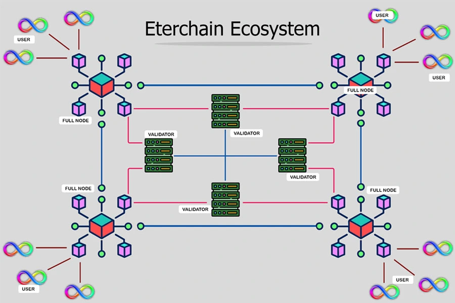

# How Eterchain Works
### eClient
The eClient is responsible for initiating transactions and sending data to the network node for validation. It acts as the user interface, allowing participants to interact with the blockchain, send and receive tokens, and execute smart contracts.

### Gateway
The Gateway serves as an intermediary that connects new participants to the Eterchain network. Gateways help expand the network by onboarding new users and facilitating their initial transactions. In return, gateways earn rewards based on the activity and contributions of the users they bring to the ecosystem.

### Node
The Node is a crucial part of the Eterchain network. It stores a copy of the blockchain, processes transactions, and ensures data consistency across the network. Nodes are also responsible for propagating transactions and blocks to other nodes.

### Validator
The Validator plays a critical role in maintaining the integrity and security of the Eterchain network. Validators verify the authenticity of transactions and blocks, participate in consensus mechanisms, and ensure that only valid data is added to the blockchain. They may also earn rewards for their work in securing the network.

### Implementation

